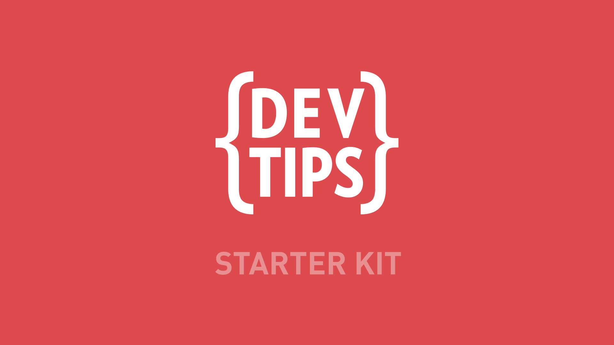

# Static Portfolio WebPage.
===================
## Build with Travis Neilsons YouTube guide.
Updated with my own ideas.
## Stack for this project:
* The Services:
** Github
** Formspree.io

<a href="http://www.youtube.com/watch?feature=player_embedded&v=GTBaQ2DcGUk
" target="_blank">
Watch the video on YouTube

</a>
